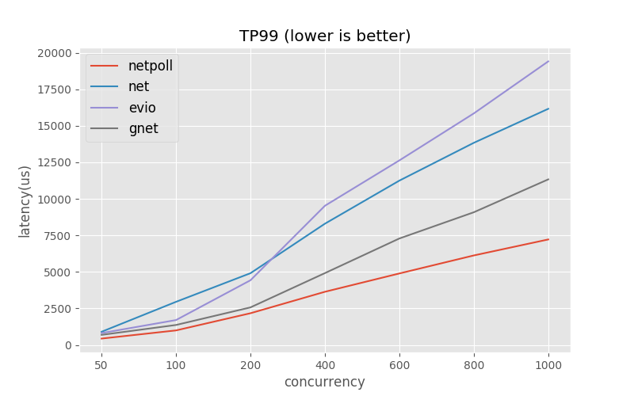
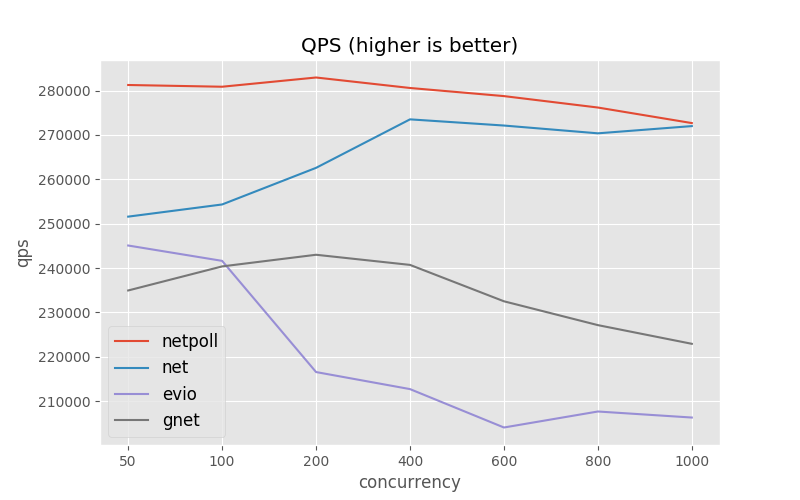
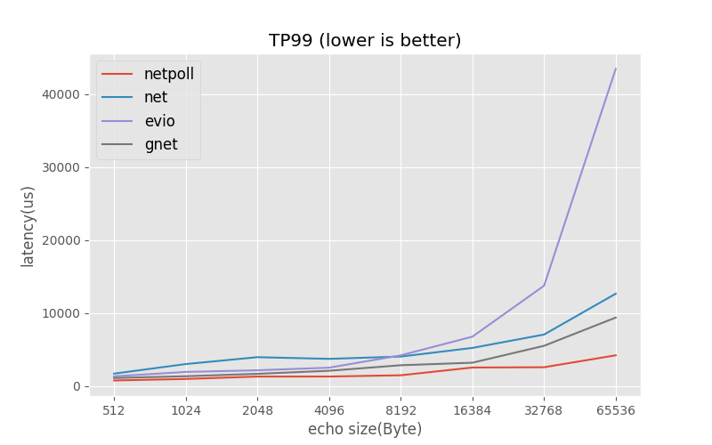
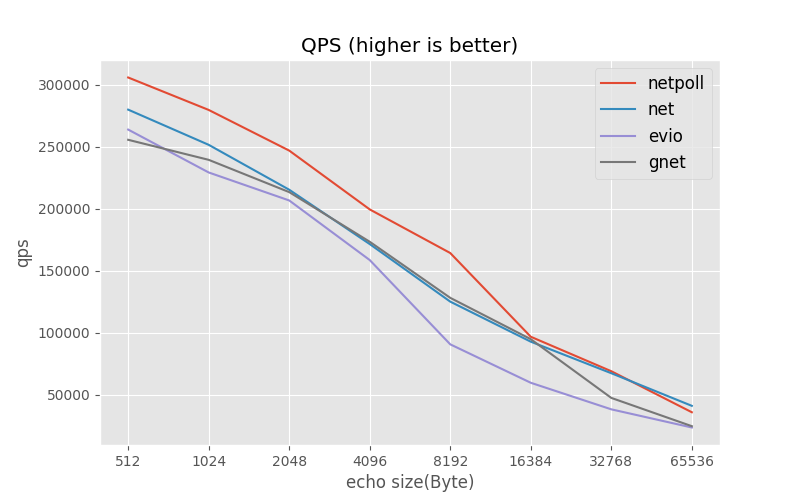

[中文](README_CN.md)

# Introduction

[Netpoll][Netpoll] is a high-performance non-blocking I/O networking framework, which
focused on RPC scenarios, developed by [ByteDance][ByteDance].

RPC is usually heavy on processing logic and therefore cannot handle I/O serially. But Go's standard
library [net][net] designed blocking I/O API, so that the RPC framework can
only follow the One Conn One Goroutine design. It will waste a lot of cost for context switching, due to a large number
of goroutines under high concurrency. Besides, [net.Conn][net.Conn] has
no API to check Alive, so it is difficult to make an efficient connection pool for RPC framework, because there may be a
large number of failed connections in the pool.

On the other hand, the open source community currently lacks Go network libraries that focus on RPC scenarios. Similar
repositories such as: [evio][evio], [gnet][gnet], etc., are all
focus on scenarios like [Redis][Redis], [Haproxy][Haproxy].

But now, [Netpoll][Netpoll] was born and solved the above problems. It draws inspiration
from the design of [evio][evio] and [netty][netty], has
excellent [Performance](#performance), and is more suitable for microservice architecture.
Also [Netpoll][Netpoll] provides a number of [Features](#features), and it is recommended
to replace [net][net] in some RPC scenarios.

We developed the RPC framework [KiteX][KiteX] and HTTP
framework [Hertz][Hertz] (to be open sourced) based
on [Netpoll][Netpoll], both with industry-leading performance.

[Examples][Netpoll-Benchmark] show how to build RPC client and server
using [Netpoll][Netpoll].

For more information, please refer to [Document](#document).

# Features

* **Already**
    - [LinkBuffer][LinkBuffer] provides nocopy API for streaming reading and writing
    - [gopool][gopool] provides high-performance goroutine pool
    - [mcache][mcache] provides efficient memory reuse
    - [multisyscall][multisyscall] supports batch system calls
    - `IsActive` supports checking whether the connection is alive
    - `Dialer` supports building clients
    - `EventLoop` supports building a server
    - TCP, Unix Domain Socket
    - Linux, Mac OS (operating system)

* **Future**
    - [io_uring][io_uring]
    - Shared Memory IPC
    - Serial scheduling I/O, suitable for pure computing
    - TLS
    - UDP

* **Unsupported**
    - Windows (operating system)

# Performance

Benchmark is not a digital game, it should meet the requirements of industrial use first. In the RPC scenario,
concurrent calls and waiting timeout are necessary support items.

Therefore, we set that the benchmark should meet the following conditions:

1. Support concurrent calls, support timeout(1s)
2. Use protocol: header(4 bytes) indicates the total length of payload

Similar repositories such as [net][net]
, [evio][evio], [gnet][gnet]. We compared their performance
through [Benchmarks][Benchmarks], as shown below.

For more benchmark reference [Netpoll-Benchmark][Netpoll-Benchmark]
, [KiteX-Benchmark][KiteX-Benchmark] and [Hertz-Benchmark][Hertz-Benchmark] .

### Environment

* CPU:    Intel(R) Xeon(R) Gold 5118 CPU @ 2.30GHz, 4 cores
* Memory: 8GB
* OS:     Debian 5.4.56.bsk.1-amd64 x86_64 GNU/Linux
* Go:     1.15.4

### Concurrent Performance (Echo 1KB)

### Transport Performance (concurrent=100)

### Benchmark Conclusion

Compared with [net][net]
, [Netpoll][Netpoll] latency about 34% and qps about 110%
(continue to pressurize, net latency is too high to reference)

# Document

* [Usage](docs/guide/usage.md)
* [Design](docs/reference/design.md)
* [Change Log](docs/reference/change_log.md)
* [Why DATA RACE](docs/reference/explain.md)

[Netpoll]: https://github.com/cloudwego/netpoll
[net]: https://github.com/golang/go/tree/master/src/net
[net.Conn]: https://github.com/golang/go/blob/master/src/net/net.go
[evio]: https://github.com/tidwall/evio
[gnet]: https://github.com/panjf2000/gnet
[netty]: https://github.com/netty/netty
[KiteX]: https://github.com/cloudwego/kitex
[Hertz]: https://github.com/cloudwego/hertz

[Benchmarks]: https://github.com/cloudwego/netpoll-benchmark
[Netpoll-Benchmark]: https://github.com/cloudwego/netpoll-benchmark
[KiteX-Benchmark]: https://github.com/cloudwego/kitex
[Hertz-Benchmark]: https://github.com/cloudwego/hertz 

[ByteDance]: https://www.bytedance.com
[Redis]: https://redis.io
[Haproxy]: http://www.haproxy.org

[LinkBuffer]: nocopy_linkbuffer.go
[gopool]: https://github.com/bytedance/gopkg/tree/develop/util/gopool
[mcache]: https://github.com/bytedance/gopkg/tree/develop/lang/mcache
[multisyscall]: https://github.com/cloudwego/multisyscall
[io_uring]: https://github.com/axboe/liburing
